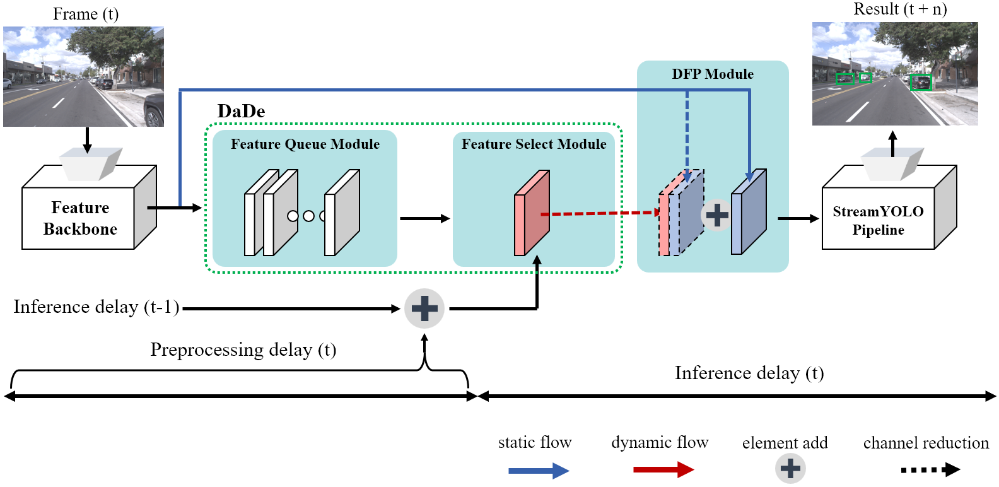

# DaDe: Delay-adaptive Detector for Streaming Perception
[](https://arxiv.org/abs/2212.11558)
<!-- ## Introduction -->
This repository is an official implementation of DaDe.
<p align='center'>
  
</p>
DaDe is simple but effective method for detecting objects in real-time. Multi-time-step prediction can be performed using the feature queue module and feature select module without any additional computation. It achieved state-of-the-art performance in a delayed environment.

## Main Results
|Model  | sAP 0.5:0.95 | sAP 50 |sAP 75| weights | COCO pretrained weights |
| ------        |:---:     |:---:  | :---: | :----: | :----: |
|[DaDe-l](./cfgs/l_s50_onex_dade_tal_filp.py)    |36.7     |57.9 | 37.3 |[github](https://github.com/yancie-yjr/StreamYOLO/releases/download/0.1.0rc/l_s50_one_x.pth) |[github](https://github.com/yancie-yjr/StreamYOLO/releases/download/0.1.0rc/yolox_l.pth) |

## Dataset Preparation
This implementation is built upon StreamYOLO.

Download Argoverse-1.1 full dataset and annotation at this [link](https://www.cs.cmu.edu/~mengtial/proj/streaming/).

The folder structure should be organized as below.
```shell
dade
├── exps
├── tools
├── yolox
├── data
│   ├── Argoverse-1.1
│   │   ├── annotations
│   │       ├── tracking
│   │           ├── train
│   │           ├── val
│   │           ├── test 
│   ├── Argoverse-HD
│   │   ├── annotations
│   │       ├── test-meta.json
│   │       ├── train.json
│   │       ├── val.json
```

## Environment Setup
```shell
# Create virtual environment
conda create --name dade python=3.7
conda activate dade

pip install torch==1.7.1+cu110 torchvision==0.8.2+cu110 torchaudio==0.7.2 -f https://download.pytorch.org/whl/torch_stable.html
pip3 install yolox==0.3

git clone https://github.com/danjos95/DADE.git
cd dade

ADDPATH=$(pwd)
echo export PYTHONPATH=$PYTHONPATH:$ADDPATH >> ~/.bashrc
source ~/.bashrc

# Installing `mmcv` for the official sAP evaluation:
# Please replace `{cu_version}` and ``{torch_version}`` with the versions you are currently using.
pip install mmcv-full==1.1.5 -f https://download.openmmlab.com/mmcv/dist/{cu_version}/{torch_version}/index.html
```

## Train
#### Step1. Build symbolic link to Argoverse-HD dataset.
```shell
cd <dade_HOME>
ln -s /path/to/your/Argoverse-1.1 ./data/Argoverse-1.1
ln -s /path/to/your/Argoverse-HD ./data/Argoverse-HD
```
#### Step2. Train model with Argoverse-HD dataset:
```shell
python tools/train.py -f cfgs/l_s50_onex_dade_tal_filp.py -d 8 -b 32 -c /path/to/coco_pretrained_weights.pth -o --fp16
```
* -d: number of gpu devices.
* -b: total batch size, the recommended number for -b is num-gpu * 8.
* --fp16: mixed precision training.
* -c: model checkpoint path.

## Online Evaluation
Modified online evaluation from [sAP](https://github.com/mtli/sAP)
```shell
cd sAP/dade
. dade_l_streamyolo.sh
```
## BibTeX
If this work is helpful for your research, please consider citing:

```
@conference{visapp23,
author={Wonwoo Jo. and Kyungshin Lee. and Jaewon Baik. and Sangsun Lee. and Dongho Choi. and Hyunkyoo Park.},
title={DaDe: Delay-Adaptive Detector for Streaming Perception},
booktitle={Proceedings of the 18th International Joint Conference on Computer Vision, Imaging and Computer Graphics Theory and Applications (VISIGRAPP 2023) - Volume 5: VISAPP},
year={2023},
pages={39-46},
publisher={SciTePress},
organization={INSTICC},
doi={10.5220/0011610700003417},
isbn={978-989-758-634-7},
issn={2184-4321},
}
```
